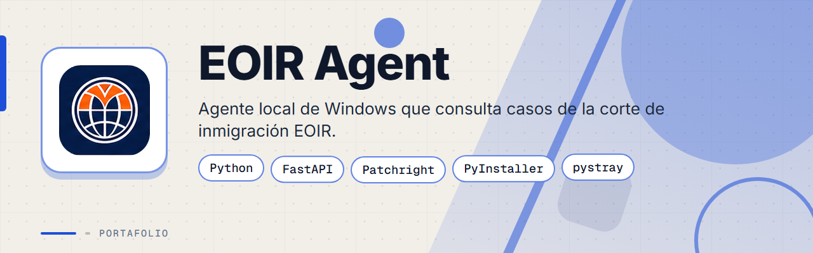
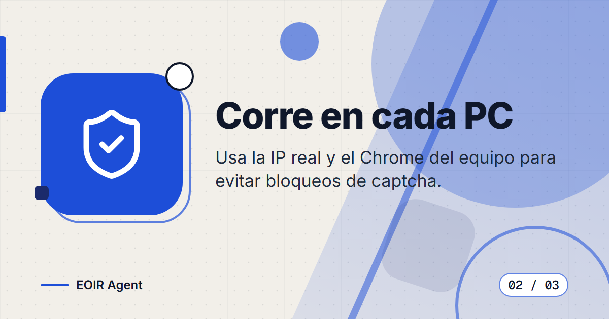
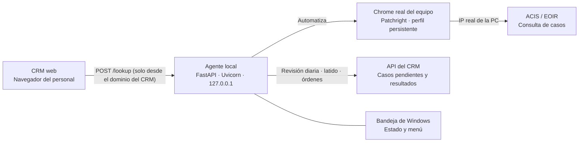

# EOIR Agent

**Agente local de Windows que consulta el estado de casos de la corte de inmigración (EOIR) por número A y nacionalidad, ejecutándose en cada PC del personal para usar su IP real y su propio Chrome.**

> Este es un **portafolio showcase**: el código fuente es propietario y no está incluido.

---

## Contenido

- [El Problema](#el-problema)
- [La Solución](#la-solución)
- [Funcionalidades](#funcionalidades)
- [Vista Previa](#vista-previa)
- [Arquitectura](#arquitectura)
- [Stack Tecnológico](#stack-tecnológico)
- [Instalación local](#instalación-local)
- [Roadmap](#roadmap)
- [Contacto](#contacto)

---

## El Problema

Un despacho de inmigración necesitaba consultar con frecuencia el estado de los casos en el sistema ACIS de EOIR desde su CRM, pero:

- Las consultas desde un servidor o VPS (IP de centro de datos) son bloqueadas de forma sistemática por el hCaptcha de ACIS.
- Revisar caso por caso a mano consume tiempo del personal.
- Un bloqueo de captcha no debe confundirse con un caso inexistente.
- Distribuir una herramienta a muchas PC sin permisos de administrador y mantenerla actualizada es complicado.

---

## La Solución

Un agente de segundo plano para Windows que corre en la PC de cada miembro del personal. Expone una API local en `127.0.0.1` que el CRM consume desde el navegador, y realiza la consulta con el Chrome real del equipo y un perfil persistente, de modo que la búsqueda sale desde la IP legítima de esa máquina. El agente se instala solo (con consentimiento), se inicia con la sesión, se vigila a sí mismo y se actualiza automáticamente.

---

## Funcionalidades

| Funcionalidad | Descripción |
|---------------|-------------|
| Consulta por número A | Busca el caso por número A y nacionalidad y devuelve estados claros: encontrado, no encontrado, nacionalidad inválida, caso no disponible, captcha bloqueado y error del servicio |
| Corre en cada PC | Usa la IP real y el Chrome instalado del equipo, con un perfil persistente, para evitar bloqueos de captcha |
| API local segura | Servidor que escucha solo en `127.0.0.1` con CORS restringido al dominio del CRM |
| Consentimiento único | Diálogo de consentimiento una sola vez por equipo; si se rechaza, no se instala nada |
| Autoinstalación e inicio automático | Se copia a una carpeta de usuario y se registra para iniciar con la sesión, sin permisos de administrador |
| Icono en la bandeja | Indicador de estado silencioso con menú contextual, incluida la opción "Ejecutar ahora" |
| Revisión diaria desatendida | Barrido opcional fuera del horario laboral (por defecto 6 pm a 7 am) de los casos pendientes del CRM, con resultados enviados de vuelta al CRM |
| Autoactualización | Revisa la versión una vez al día, verifica la integridad del paquete con SHA-256 y revierte si la nueva versión no arranca |
| Control remoto | Consulta periódica al CRM para reportar versión y estado, y recibir órdenes de actualizar o reiniciar |
| Vigilancia y registros | Instancia única, tarea programada de vigilancia, detección de suspensión y reanudación, y registros de eventos |
| Módulo ICE | Barrido desatendido hermano para el localizador de detenidos de ICE, integrado en el mismo agente |

---

## Vista Previa

<table>
  <tr>
    <td width="50%">
      
       <b>Consulta por A-Number</b>: busca el estado del caso por número A y nacionalidad en ACIS.
    </td>
    <td width="50%">
      
       <b>Corre en cada PC</b>: usa la IP real y el Chrome del equipo para evitar bloqueos de captcha.
    </td>
  </tr>
  <tr>
    <td width="50%">
      
       <b>API local segura</b>: servidor en 127.0.0.1 con CORS restringido al CRM de la empresa.
    </td>
    <td width="50%"></td>
  </tr>
</table>

---

## Arquitectura

**API local:** `POST /lookup` con el número A y la nacionalidad. Respuestas: `found`, `not_found`, `invalid_nationality`, `case_unavailable`, `captcha_blocked` (503, reintentar más tarde) y `upstream_error` (500).

**Distribución:** paquete de Windows generado con PyInstaller en modo carpeta (no un solo archivo, para evitar falsos positivos del antivirus), entregado como un zip estático. Las actualizaciones se verifican con SHA-256 antes de aplicarse.

---

## Stack Tecnológico

| Capa | Tecnología |
|------|-----------|
| Lenguaje | Python 3.12 |
| API local | FastAPI · Uvicorn |
| Automatización | Patchright sobre el Chrome instalado en el equipo |
| Bandeja del sistema | pystray · Pillow |
| Empaquetado | PyInstaller (modo carpeta) |
| Pruebas | pytest · httpx |
| Plataforma | Windows (inicio automático por usuario, sin administrador) |

---

## Instalación local

> **Aviso:** el código es privado y propietario. Estos pasos describen la instalación del ejecutable empaquetado en una PC del personal.

1. Verifica que la PC tenga Google Chrome instalado (el agente usa el navegador del equipo).
2. Descarga el paquete zip del agente y extrae todo su contenido en una carpeta (no ejecutes el programa desde dentro del zip).
3. Ejecuta `eoir_agent.exe`. En el primer inicio se muestra un diálogo de consentimiento; al aceptar, el agente se copia a una carpeta de usuario y se registra para iniciar con la sesión.
4. El icono aparece en la bandeja de Windows y la API local queda activa solo en `127.0.0.1`.
5. Opcional: el soporte técnico puede colocar un archivo de configuración con las credenciales de una cuenta de servicio para habilitar la revisión diaria desatendida.

---

## Roadmap

- [ ] Firmar digitalmente el ejecutable para reducir los falsos positivos de Windows y del antivirus.
- [ ] Automatizar la primera migración a la versión con autoactualización (hoy requiere reinstalación manual en equipos antiguos).
- [ ] Simplificar la entrega del archivo de configuración de la revisión diaria en cada PC nueva.

---

## Contacto

El código fuente es propietario. Para consultas o propuestas, escríbeme:

[%206517--1870-25D366?style=for-the-badge&logo=whatsapp&logoColor=white)](https://wa.me/50765171870)

- Correo: [pablozam1931@gmail.com](mailto:pablozam1931@gmail.com)
- WhatsApp: [(507) 6517-1870](https://wa.me/50765171870)
- GitHub: [github.com/deadlyrat](https://github.com/deadlyrat)

---

*Parte del portafolio de [deadlyrat](https://github.com/deadlyrat)*
